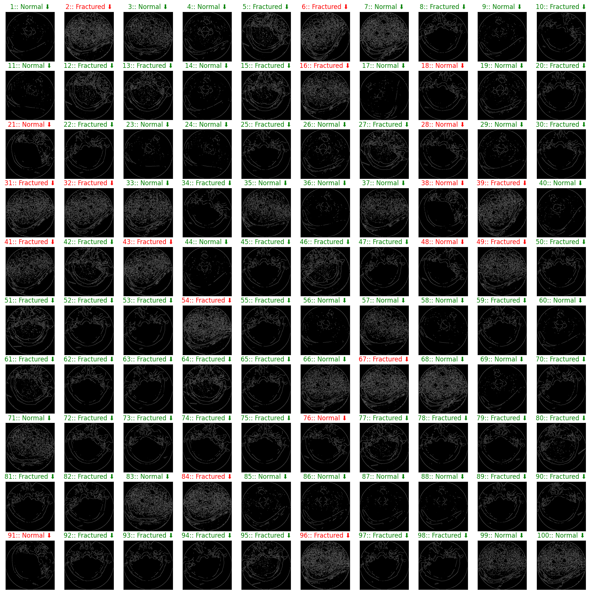
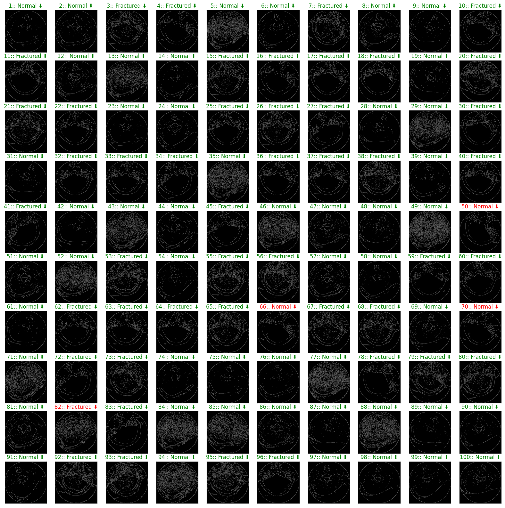
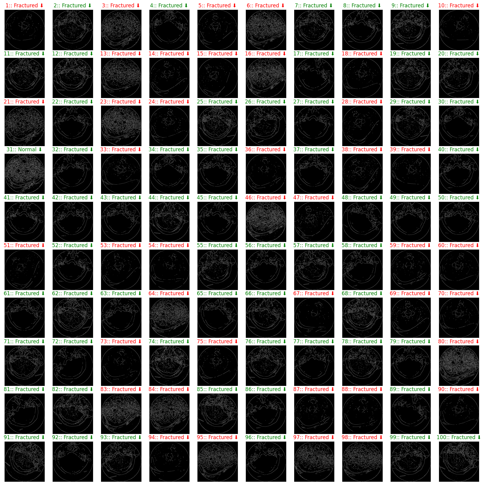

# Cervix Spine Fracture Classifier using Enhanced Canny Edge Detection and Support Vector Machine
This mini-project aimed to develop a classification model using Support Vector Machine (SVM) to accurately predict cervical spine
fractures in x-ray scans. The group collected data from Kaggle, applied image pre-processing (using Enhanced Canny Edge Detection as a feature selection technique) and data pre-processing techniques, and trained three different SVM models. The models were evaluated using the confusion matrix, classification report scores, and AUC-ROC curve, with SVM Model (b) performing the best in terms of accuracy, precision, recall, and F1 scores. However, SVM Model (a) had the fastest run-time, followed by SVM Model (c) and SVM Model (b). Overall, these results suggest that machine learning and computer vision techniques can improve the
accuracy and efficiency of cervical spine fracture diagnosis.

# Sample Output (Predictions on 100 Test Images)
NOTE:
- Green Text: True Positive
- Red Text: False Positive
## For SVM Model (a)

## For SVM Model (b)

## For SVM Model (c)
